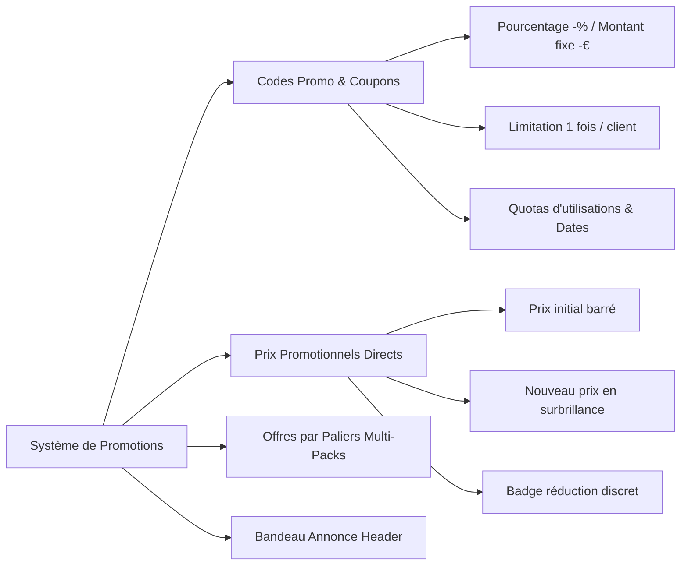
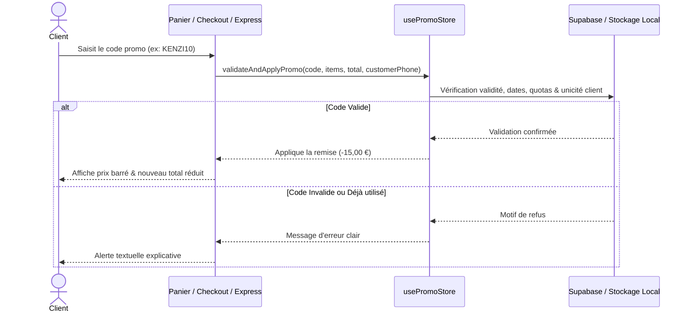

# Cahier des Charges & Plan d'Implémentation — Système de Promotions Maison Kenzi

---

## 1. Vision & Principes Fondamentaux

Le système de promotions de **Maison Kenzi** a pour objectif de dynamiser les ventes, de fidéliser la clientèle et de gérer des opérations commerciales ciblées (soldes privées, offres de bienvenue, remises saisonnières, codes influenceurs) tout en préservant l'identité visuelle **Haute Parfumerie & Luxury Nude**.

### Règles d'Ingénierie & d'Interface :
- **Zéro Emoji** : Utilisation exclusive d'icônes vectorielles professionnelles (`lucide-react`) avec un style de trait uniforme.
- **Typographie & Esthétique** : Badges dorés discrets, prix barrés feutrés et mise en valeur sobre des réductions.
- **Sécurité Anti-Fraude** : Contrôle strict des utilisations par client (numéro de téléphone / email) et vérification côté client et serveur.
- **Multi-Canal Transparent** : Les réductions sont répercutées fidèlement dans la commande WhatsApp, le tunnel de commande et le paiement en ligne sécurisé Stripe.

---

## 2. Typologie des Promotions



### A. Codes Promo & Coupons de Réduction
* **Formats de Réduction** :
  - **Pourcentage** : `-10%`, `-15%`, `-20%` sur le montant total des articles éligibles.
  - **Montant Fixe** : `-10 €`, `-15 €`, `-20 €` déduits de la commande.
  - **Livraison Offerte** : Prise en charge intégrale des frais d'expédition.
* **Critères d'Application** :
  - **Code personnalisé** : Saisie libre (ex: `KENZI10`, `BIENVENUE15`, `ETE2026`).
  - **Montant minimum d'achat** : Seuil en Euro pour activer le code (ex: *applicable dès 60 € d'achat*).
  - **Période de validité** : Date de début et date de fin avec expiration automatique à minuit.
  - **Ciblage par Univers** : Applicable sur *Tout le catalogue* ou restreint à une catégorie (ex: *Parfums uniquement*, *Cosmétiques uniquement*).

### B. Prix Promotionnels Directs & Prix Barrés
* **Gestion Produit** : Activation d'une remise directe sur un produit depuis l'administration.
* **Affichage Vitrine** :
  - Ancien prix barré en texte estompé (ex: ~~120,00 €~~).
  - Prix promotionnel mis en valeur en couleur or/accent (**99,00 €**).
  - Badge haute couture calculé automatiquement (ex: `-[18%]`, `Offre Privilège`).

### C. Bandeau Promotionnel en En-tête (Top Bar Ticker)
* Ruban défilant élégant au sommet du site annonçant l'opération en cours.
* Bouton interactif pour **copier le code promo en 1 clic** avec micro-animation fluide.

---

## 3. Sécurité Anti-Fraude & Règles de Validation

Pour garantir un usage équitable et protéger la marge de la boutique, chaque coupon applique des filtres stricts :

| Règle de Sécurité | Mécanisme de Contrôle | Message Utilisateur |
| :--- | :--- | :--- |
| **Usage Unique par Client** | Vérification du numéro de téléphone et de l'adresse email dans l'historique des commandes. | *« Ce code promotionnel a déjà été utilisé avec ce numéro de téléphone. »* |
| **Quota Global Maximal** | Compteur d'utilisations (`current_uses >= max_uses`). Désactivation automatique dès le seuil atteint. | *« Ce code promotionnel a atteint sa limite maximale d'utilisations. »* |
| **Date d'Expiration** | Comparaison temporelle stricte avec l'horloge système. | *« Ce code promotionnel a expiré le [Date]. »* |
| **Montant Minimum** | Vérification du sous-total du panier avant validation. | *« Ce code nécessite un panier minimum de [X] €. »* |
| **Univers Incompatible** | Vérification de la présence d'articles de la catégorie ciblée dans le panier. | *« Ce code est réservé aux produits de la catégorie [Catégorie]. »* |

---

## 4. Modèles de Données & Architecture Technique

### Modèle TypeScript — `PromoCode`
```typescript
/**
 * Interface représentant un code promotionnel dans le système
 */
export interface PromoCode {
  id: string;
  code: string;                     // ex: "KENZI10" (majuscules d'imprimerie)
  description?: string;             // ex: "Offre d'ouverture -10%"
  type: "percentage" | "fixed";     // Type de remise : % ou montant fixe en €
  value: number;                    // Valeur numérique (ex: 10 pour 10% ou 10€)
  min_order_amount?: number;        // Montant minimum de commande en €
  max_uses?: number;                // Limite globale d'utilisations (null = illimité)
  current_uses: number;             // Nombre d'utilisations enregistrées
  once_per_customer: boolean;       // Limiter à 1 seule utilisation par client
  is_active: boolean;               // Interrupteur d'activation / désactivation
  start_date?: string;              // Date ISO de début de validité
  end_date?: string;                // Date ISO de fin de validité
  target_category?: string;         // "all" ou slug de catégorie spécifique
  created_at: string;
  updated_at: string;
}

/**
 * Résultat de l'application d'un code promotionnel
 */
export interface PromoValidationResult {
  isValid: boolean;
  promo?: PromoCode;
  discountAmount: number;           // Montant de la réduction calculé en €
  finalAmount: number;              // Montant final après réduction en €
  errorMessage?: string;            // Message d'erreur explicatif si invalide
}
```

### Schéma Base de Données Supabase SQL
```sql
-- 1. Table principale des codes promotionnels
CREATE TABLE IF NOT EXISTS public.promotions (
  id UUID PRIMARY KEY DEFAULT gen_random_uuid(),
  code VARCHAR(50) UNIQUE NOT NULL,
  description TEXT,
  type VARCHAR(20) NOT NULL CHECK (type IN ('percentage', 'fixed')),
  value NUMERIC(10, 2) NOT NULL CHECK (value > 0),
  min_order_amount NUMERIC(10, 2) DEFAULT 0,
  max_uses INTEGER DEFAULT NULL,
  current_uses INTEGER DEFAULT 0,
  once_per_customer BOOLEAN DEFAULT TRUE,
  is_active BOOLEAN DEFAULT TRUE,
  start_date TIMESTAMPTZ DEFAULT NOW(),
  end_date TIMESTAMPTZ DEFAULT NULL,
  target_category VARCHAR(50) DEFAULT 'all',
  created_at TIMESTAMPTZ DEFAULT NOW(),
  updated_at TIMESTAMPTZ DEFAULT NOW()
);

-- 2. Table de traçabilité des utilisations par client
CREATE TABLE IF NOT EXISTS public.promotion_redemptions (
  id UUID PRIMARY KEY DEFAULT gen_random_uuid(),
  promo_id UUID NOT NULL REFERENCES public.promotions(id) ON DELETE CASCADE,
  promo_code VARCHAR(50) NOT NULL,
  order_number VARCHAR(100),
  customer_phone VARCHAR(50),
  customer_email VARCHAR(150),
  discount_applied NUMERIC(10, 2) NOT NULL,
  created_at TIMESTAMPTZ DEFAULT NOW()
);

-- Index pour recherche rapide lors de la vérification d'unicité client
CREATE INDEX IF NOT EXISTS idx_redemptions_phone ON public.promotion_redemptions(customer_phone, promo_code);
CREATE INDEX IF NOT EXISTS idx_redemptions_email ON public.promotion_redemptions(customer_email, promo_code);
```

---

## 5. Parcours Utilisateur & Intégration Frontend



### Intégrations par Composant :
1. **Fiche Produit & Grilles (`ProductDetail.tsx`, `Category.tsx`)** :
   - Affichage automatique de l'ancien prix barré et du badge de remise pour les articles ayant un `promo_price`.
2. **Tiroir Panier (`CartDrawer.tsx`)** :
   - Accordéon discret *« Avez-vous un code promotionnel ? »*.
   - Champ de saisie avec bouton de validation instantanée.
   - Ligne de réduction bien visible sous le sous-total.
3. **Commande Directe Express (`ExpressOrderForm.tsx`)** :
   - Champ coupon intégré dans le bloc de récapitulatif.
   - Recalcul du total en temps réel avant validation ou transmission WhatsApp.
4. **Tunnel de Commande Panier (`Checkout.tsx`)** :
   - Ligne dédiée dans le récapitulatif de droite.
   - Transmission du montant exact remisé à **Stripe Elements** et au bon de commande final.

---

## 6. Interface d'Administration (`/admin/promotions`)

### Navigation Latérale (`AdminLayout.tsx`)
- Ajout d'une nouvelle entrée de navigation :
  - **Titre** : *« Promotions & Codes »*
  - **Icône** : `Tag` ou `Percent` (vectorielle `lucide-react`)
  - **Route** : `/admin/promotions`

### Fonctionnalités de la Page d'Administration :
1. **Cartes d'Indicateurs KPIs en Haut de Page** :
   - Codes Promo Actifs.
   - Total des Remises Accordées (€).
   - Nombre Total d'Utilisations.
2. **Tableau de Gestion Complet** :
   - Colonnes : *Code*, *Type & Valeur*, *Conditions (Seuil/Dates)*, *Utilisations (Actuelles/Max)*, *Usage Unique*, *Statut (Actif/Inactif)*, *Actions*.
   - Interrupteur d'activation / désactivation rapide en 1 clic.
   - Boutons de modification et de suppression avec modale de confirmation.
3. **Modale de Création & Édition de Code Promo** :
   - Générateur de code aléatoire en 1 clic (ex: `KENZI-8X4Y`).
   - Sélecteurs intuitifs du type de remise (% ou montant fixe en €).
   - Date picker pour début et expiration.
   - Case à cocher : *« Limiter à 1 seule utilisation par client »*.

---

## 7. Feuille de Route & Phasage de Développement

| Phase | Description & Tâches | Fichiers Cibles |
| :---: | :--- | :--- |
| **Phase 1** | **Structure de Données & Moteur de Calcul**<br>Création du store Zustand `usePromoStore`, fonctions de calcul de remises et persistance. | `src/store/usePromoStore.ts`<br>`src/types/database.ts` |
| **Phase 2** | **Interface d'Administration des Promotions**<br>Création de la page `/admin/promotions`, de la modale de création/édition et intégration dans la sidebar. | `src/admin/pages/Promotions.tsx`<br>`src/admin/AdminLayout.tsx`<br>`src/App.tsx` |
| **Phase 3** | **Gestion des Prix Barrés sur les Produits**<br>Ajout des champs promotionnels dans la modale produit et affichage des prix barrés sur le site. | `src/admin/components/ProductModal.tsx`<br>`src/components/ui/ProductCard.tsx`<br>`src/pages/ProductDetail.tsx` |
| **Phase 4** | **Intégration Tunnels de Commande**<br>Ajout des champs codes promo et calcul temps réel dans le panier, la commande directe et le checkout. | `src/store/cart.tsx`<br>`src/components/cart/CartDrawer.tsx`<br>`src/components/content/ExpressOrderForm.tsx`<br>`src/pages/Checkout.tsx` |
| **Phase 5** | **Validation Anti-Fraude & Synchronisation Stripe/WhatsApp**<br>Enregistrement des utilisations, vérification d'unicité client et mise à jour des montants Stripe. | `src/components/checkout/StripePaymentSection.tsx`<br>`src/services/promoService.ts` |

---

Ce document servira de référence pour chaque étape d'implémentation.
